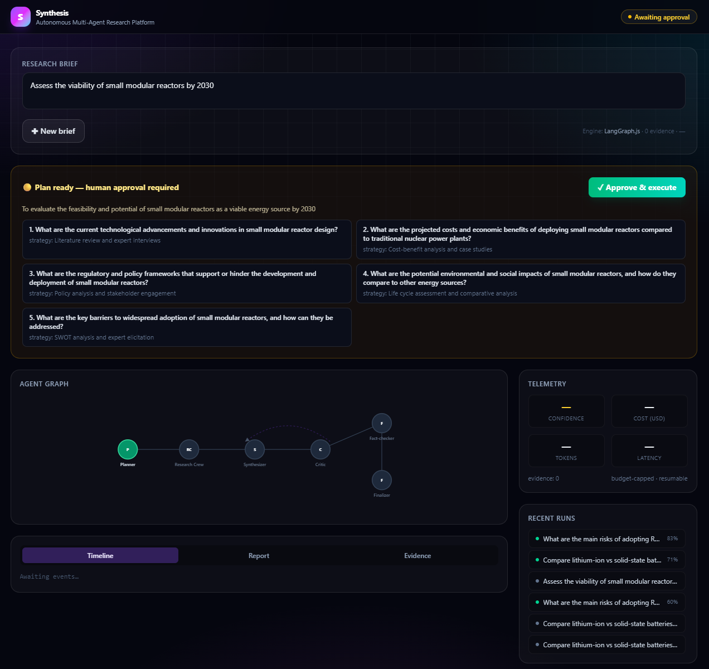
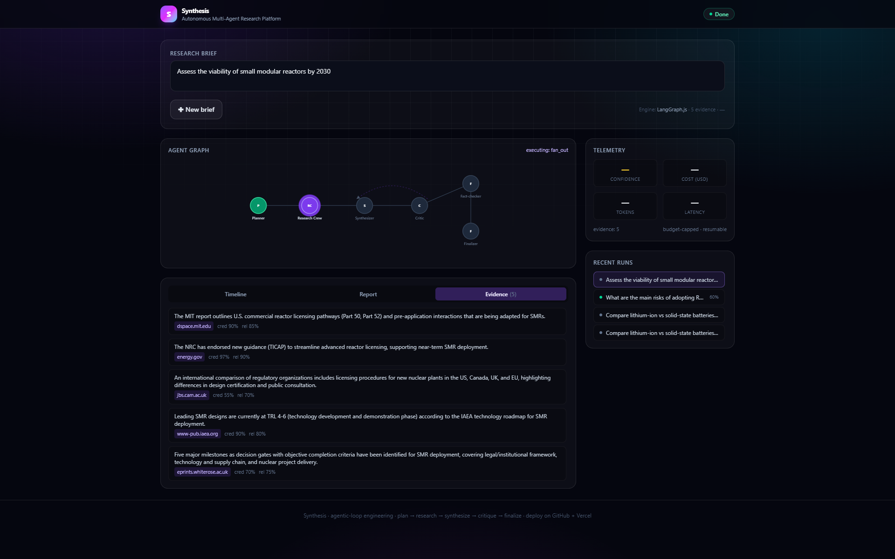
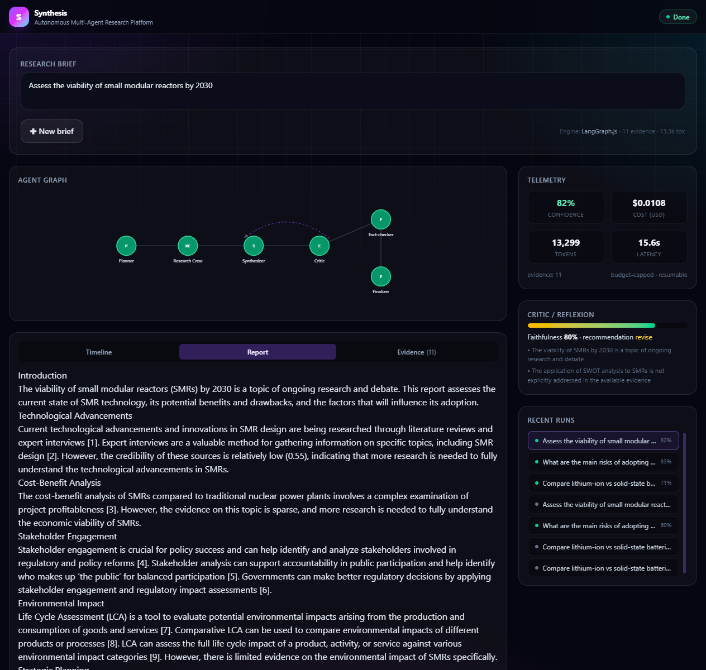
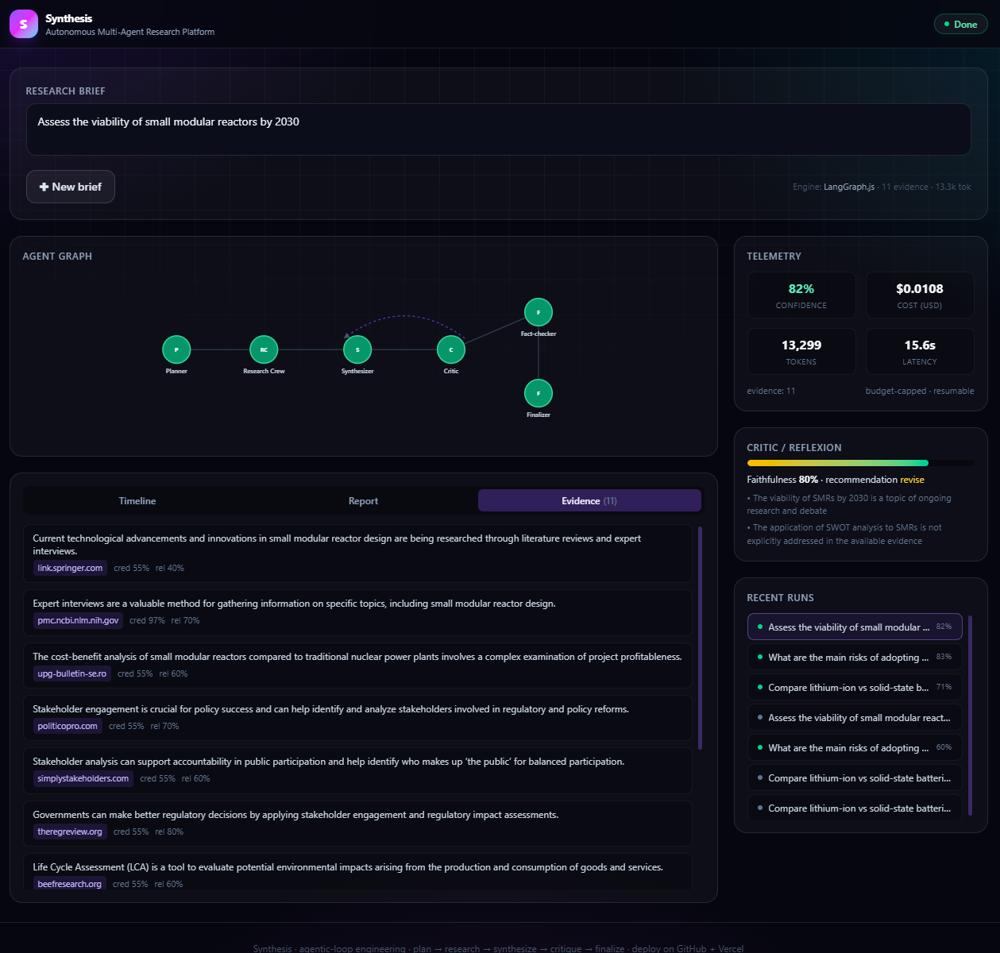

# Synthesis — Autonomous Multi-Agent Research Platform

[](https://synthesis-gold.vercel.app/)
[](https://github.com/devtechedge/synthesis/actions/workflows/ci.yml)
[](https://nextjs.org/)
[](https://www.typescriptlang.org/)
[](https://langchain-ai.github.io/langgraphjs/)
[](https://orm.drizzle.team/)
[](./LICENSE)

> Plan → research → synthesize → critique → finalize. A free-tier Vercel demo of senior agentic-loop engineering: live agent graph, HITL approval, RAG, Reflexion, streaming SSE, and an eval gate.

---

## Live Demo

**https://synthesis-gold.vercel.app/**

- **Real LLM path is live** — Groq (`llama-3.3-70b-versatile`) + Tavily web search. Full multi-agent runs with cited reports, Reflexion, and telemetry.
- **Demo / simulated mode is the default** — works with or without keys. Real LLM/search only when LIVE_MODE=true and keys are set (optional PUBLIC_RUN_TOKEN).
- Any OpenAI-compatible provider works via `OPENAI_API_KEY` + `OPENAI_BASE_URL` + `OPENAI_MODEL`.

---

## Screenshots

| Plan approval (HITL) | Run complete |
|---|---|
|  |  |

| Cited report | Evidence (11 sources) |
|---|---|
|  |  |

---

## What it does

1. **Brief** — enter a complex research question.
2. **Planner** — decomposes into research vectors; run **pauses for human-in-the-loop approval**.
3. **Research crew (parallel fan-out)** — tools (`web_search`, `read_url`), typed evidence, RAG ingest.
4. **Synthesizer** — cited Markdown report, streamed.
5. **Critic (Reflexion)** — faithfulness score; bounded revision loop if below threshold.
6. **Fact-checker** — source credibility audit.
7. **Finalizer** — confidence + cost/latency dashboard.

Every event is persisted — any past run is replayable.

---

## Agentic-loop principles (enforced)

| Principle | Implementation |
|---|---|
| **Loop is a graph, not a `while`** | `StateGraph` executor — nodes, conditional edges, explicit `END`. |
| **Plan → Act → Observe → Reflect** | ReAct tools + Reflexion critic with bounded revisions. |
| **Bounded autonomy + budget** | Max steps / tokens / cost / wall-clock → graceful finalize. |
| **Human-in-the-loop** | Planner checkpoint → `awaiting_approval` → resume on approve. |
| **Resumable state** | Full checkpoint to Postgres after every node. |
| **Structured I/O** | Zod-validated agent protocol; LLMs forced to JSON. |
| **Streaming-first** | SSE token + state events drive live graph & timeline. |
| **Observe before optimize** | Traced spans (latency / tokens / cost). |
| **Eval-driven** | `/api/eval` golden set + CI gate. |
| **Fail safe, fail cheap** | Retry/backoff, tool isolation, simulated fallback, partial results. |

---

## Architecture

```
Browser ──SSE──▶ Next.js (App Router) ──▶ Orchestration (StateGraph)
                                              │
        ┌──────────────┬──────────────────────┼───────────────────────┐
        ▼              ▼                      ▼                       ▼
   Agent crew      Tools / MCP bus        RAG / Memory           Observability
   planner         web_search, read_url,  JSONB embeddings,      event store +
   researcher      compute, query_memory  cosine retrieval,      cost/token/lat
   synthesizer                            long-term memory        spans
   critic
   fact_checker
   finalizer
        │
        ▼
   Postgres: runs · checkpoints · events · documents · evidence · memories · eval_runs
```

**Portability:** embeddings as JSONB float arrays (no pgvector required) — runs on any Neon / Vercel Postgres free DB.

---

## Key source

```
src/
├─ db/schema.ts                 # Drizzle schema
├─ lib/agent/
│  ├─ schemas.ts                # Zod state + AgentEvent protocol
│  ├─ llm.ts                    # OpenAI-compatible client + simulated mode
│  ├─ tools.ts                  # web_search / read_url / compute
│  ├─ rag.ts                    # embeddings, ingest, cosine retrieve
│  ├─ graph.ts                  # StateGraph executor
│  ├─ agents.ts                 # planner → finalizer crew
│  ├─ engine.ts                 # planResearch (HITL) + runResearch (stream)
│  └─ tracer.ts                 # SSE + durable events + cost spans
├─ app/api/run/...              # create, approve (SSE), detail, eval
└─ components/synthesis/        # App, AgentGraph, Timeline, ReportView
```

---

## Local dev

```bash
npm install
cp .env.example .env          # DATABASE_URL required; LLM/search keys optional
npx drizzle-kit push
npm run dev
```

Open http://localhost:3000.

### Demo mode (no keys)
Deterministic grounded engine — full graph, HITL, telemetry, eval. **Deployed demo always works.**

### Real mode
```
OPENAI_API_KEY=gsk_...                    # Groq (or any OpenAI-compatible key)
OPENAI_BASE_URL=https://api.groq.com/openai/v1
OPENAI_MODEL=llama-3.3-70b-versatile
TAVILY_API_KEY=...                        # live web search
```

---

## Evaluation & CI

[](https://github.com/devtechedge/synthesis/actions/workflows/ci.yml)

- **Unit tests** — Zod schemas, token/cost math, cosine, tool allow-lists, StateGraph termination, Reflexion routing (`npm test`)
- **Typecheck** — `tsc --noEmit`
- **Playwright** — Chromium smokes for idle chrome + HITL plan pause (`npm run test:e2e`)
- **Eval gate** — `GET /api/eval?limit=2` golden set (simulated engine, Postgres service)

```bash
npm ci
npm test
npm run typecheck
npm run test:e2e    # needs DATABASE_URL for the HITL path; UI smokes skip it
```

Threat model: [SECURITY.md](./SECURITY.md).

---

## Deploy (Vercel free tier)

1. Import the GitHub repo on Vercel.
2. Add Neon Postgres (Storage → Create Database → Neon) — `DATABASE_URL` is injected automatically.
3. Optional: Groq + Tavily env vars. Real spend also needs LIVE_MODE=true (keep false on public demos).
4. Optional: PUBLIC_RUN_TOKEN — live calls must send matching x-run-token.
5. Redeploy and open the live URL.

---

## Environment

See [`.env.example`](./.env.example). Only `DATABASE_URL` is required. Provider keys alone do not enable live spend — set LIVE_MODE=true (and optionally PUBLIC_RUN_TOKEN). Details: [SECURITY.md](./SECURITY.md).

---

## Roadmap

- CrewAI / AutoGen reference engines behind the same contract
- pgvector + ANN for larger corpora
- MCP tool-server exposure
- Langfuse-hosted tracing

---

## License

MIT — see [LICENSE](./LICENSE).

See also [SECURITY.md](./SECURITY.md).

Built as a senior-portfolio demonstration of agentic-loop engineering.
